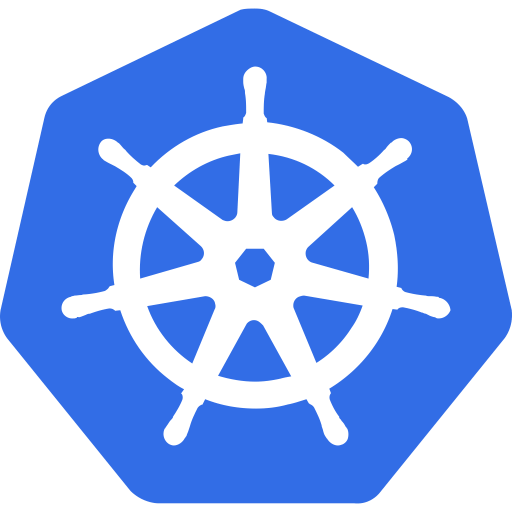

  

Delhi NCR&nbsp;&nbsp;·&nbsp;&nbsp;AWS SAA in progress&nbsp;&nbsp;·&nbsp;&nbsp;Ex-Intern @IntelliDB & IBM PBEL

  

Connect with me on
<a href="https://linkedin.com/in/ananyagupta02">LinkedIn</a>
&nbsp;&nbsp;·&nbsp;&nbsp;
Read my stories and experience on
<a href="https://medium.com/@ananyagupta.august2005">Medium</a>

 

### Contribution Snake

<picture>
  <source media="(prefers-color-scheme: dark)" srcset="https://raw.githubusercontent.com/ananya-gupta05/ananya-gupta05/output/github-contribution-grid-snake-dark.svg">
  <source media="(prefers-color-scheme: light)" srcset="https://raw.githubusercontent.com/ananya-gupta05/ananya-gupta05/output/github-contribution-grid-snake.svg">
  
</picture>

 

<table align="center">
<tr>

<td valign="top" width="45%">

**About**

- CS/IT student, Delhi NCR
- Focused on Cloud Computing & DevOps
- Currently preparing for AWS SAA (Solutions Architect Associate)
- AWS Certified Cloud Practitioner (CLF-C02)
- Built a real-time Cloud Security Detection Engine on AWS (CloudTrail, EventBridge, Lambda, DynamoDB, SNS)
- Built a fully automated CI/CD pipeline (CodePipeline → CodeBuild → ECR → ECS)

</td>

<td valign="top" width="55%">

**Tech Stack**

*Cloud*

<table>
<tr>

<td align="center">
 
EC2
</td>

<td align="center">
 
Lambda
</td>

<td align="center">
 
S3
</td>

<td align="center">
 
API Gateway
</td>

</tr>
<tr>

<td align="center">
 
DynamoDB
</td>

<td align="center">
 
IAM
</td>

<td align="center">
 
VPC
</td>

<td align="center">
 
Cognito
</td>

</tr>
<tr>

<td align="center">
 
CloudWatch
</td>

</tr>
</table>

*DevOps & Tools*

<table>
<tr>

<td align="center">
 
Git
</td>

<td align="center">
 
GitHub
</td>

<td align="center">
 
Docker
</td>

</tr>
<tr>

<td align="center">
 
GitHub Actions
</td>

<td align="center">
 
Kubernetes
</td>

<td align="center">
 
Linux
</td>

</tr>
</table>

*Observability*

<table>
<tr>

<td align="center">
 
Prometheus
</td>

<td align="center">
 
Grafana
</td>

</tr>
</table>

</td>

</tr>
</table>

 

 

**Notable Repositories**

| Repo | Description |
|---|---|
| [Orchestration & Resource Management Layer with Monitoring](https://github.com/ananya-gupta05/Orchestration-and-Resource-management-layer-with-monitoring) | Kubernetes infrastructure for a multi-tenant DBaaS — HA PostgreSQL (Patroni/etcd), gRPC provisioning API, Prometheus + Grafana observability |
| [2048 CI/CD Pipeline on AWS](https://github.com/ananya-gupta05/2048-cicd) | Fully automated CodePipeline → CodeBuild → ECR → ECS deployment pipeline |
| [Cloud Security Detection Engine](https://github.com/ananya-gupta05/cloud-security-detection-engine) | Real-time AWS security monitoring pipeline with CloudTrail, EventBridge, Lambda, and DynamoDB |
